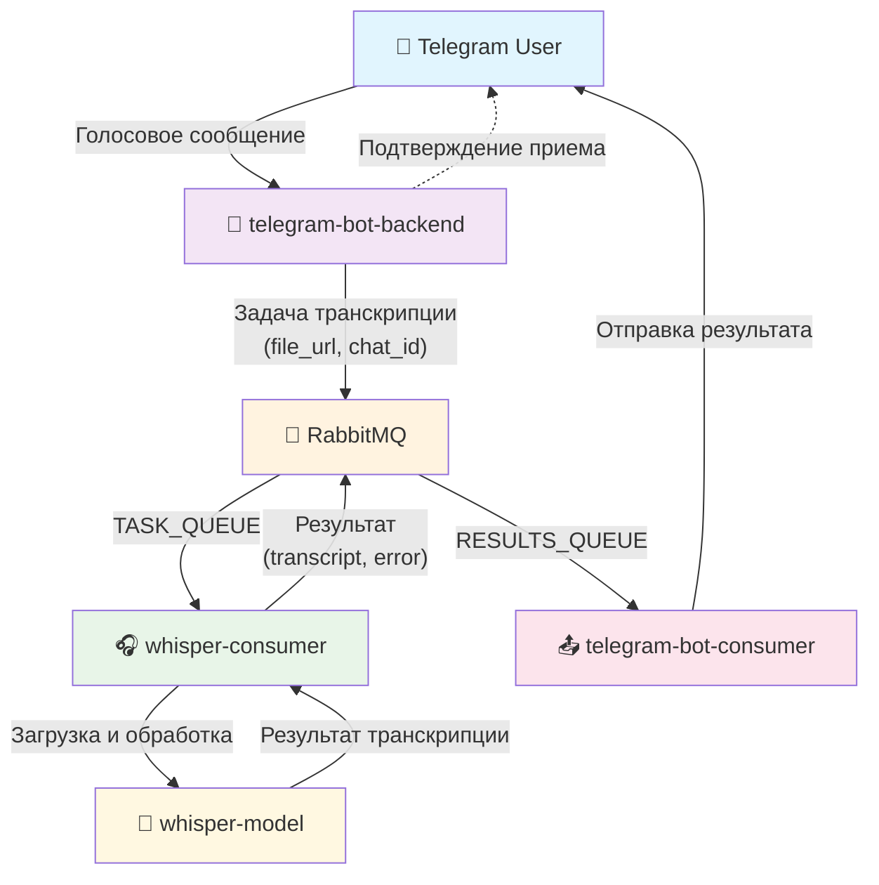

# TgWhisper - Telegram Voice Transcription System

Система для транскрипции голосовых сообщений в Telegram с использованием WhisperX модели.

## Архитектура

Проект состоит из следующих компонентов:

### Микросервисы

1. **telegram-bot-backend** - Telegram бот, принимающий голосовые сообщения
2. **telegram-bot-consumer** - Воркер для отправки результатов транскрипции
3. **whisper-consumer** - Воркер для обработки голосовых сообщений
4. **whisper-model** - Библиотека для транскрипции с WhisperX

### Инфраструктура

- **RabbitMQ** - Очереди сообщений между сервисами
- **Redis** - Кэширование (подготовлен в docker-compose)

## Поток данных



## Запуск

```bash
# Запуск инфраструктуры
docker-compose up -d rabbitmq redis

# Запуск сервисов
docker-compose up telegram_bot_backend whisper_consumer_worker
```

## Конфигурация

### Переменные окружения

- `BOT_TOKEN` - Токен Telegram бота
- `RABBITMQ_URL` - URL подключения к RabbitMQ
- `TASK_QUEUE_NAME` - Имя очереди для задач транскрипции
- `RESULTS_QUEUE_NAME` - Имя очереди для результатов
- `WHISPER_CONFIG_JSON_PATH` - Путь к JSON конфигурации WhisperX

### Конфигурация WhisperX

Пример конфигурации в JSON:
```json
{
  "whisper_config": {
    "whisper_arch": "large-v2",
    "compute_type": "int8_float16",
    "device": "cuda",
    "asr_options": {
      "beam_size": 5,
      "best_of": 5
    },
    "transcribe_options": {
      "batch_size": 16
    },
    "language": "ru"
  },
  "align_config": {
    "language_code": "ru",
    "device": "cuda"
  },
  "segmentation_config": {
    "device": "cuda",
    "model": "pyannote/segmentation",
    "batch_size": 32,
    "step": 0.75,
    "peak_config": {
      "min_duration": 1,
      "alpha": 0.18
    }
  }
}
```

## Особенности реализации

- Используется библиотека **dramatiq** для асинхронной обработки очередей
- **WhisperX** поддерживает выравнивание по словам и сегментацию спикеров
- Результаты форматируются с заглавными буквами и разделением по сегментам
- Временные файлы автоматически удаляются после обработки
- Бот поддерживает как polling, так и webhook режимы

## Дополнительная документация

- [Архитектурное ревью](./architecture-review.md) - детальный анализ архитектуры 