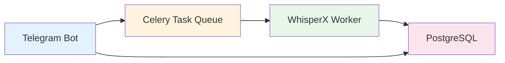
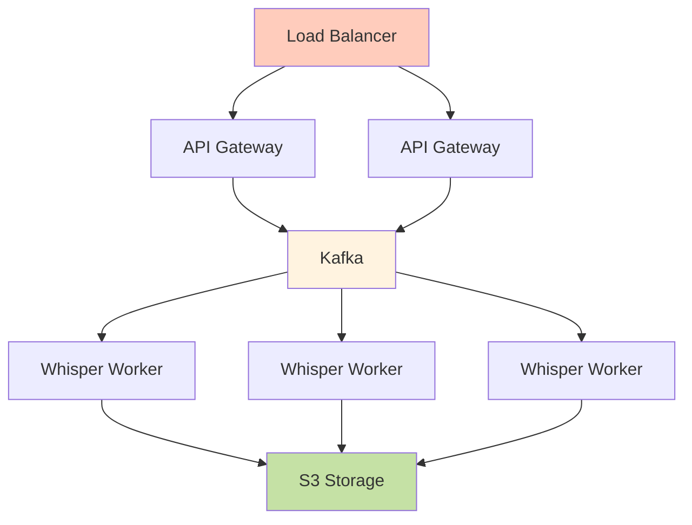

# Архитектурное ревью TgWhisper

## Резюме

Проект демонстрирует отличное понимание микросервисной архитектуры и современных практик разработки. Для учебных целей - это образцовая реализация.

## Сильные стороны

### 1. Архитектурные решения
- **Message-driven архитектура** с RabbitMQ
- **Четкое разделение ответственности** между сервисами
- **Асинхронная обработка** для лучшего UX
- **Отказоустойчивость** - падение одного сервиса не ломает систему

### 2. Технологический стек
- **Modern Python** (async/await, type hints, Pydantic)
- **Production-ready инструменты** (Docker, RabbitMQ)
- **Правильные библиотеки** (aiogram, dramatiq, WhisperX)

### 3. Качество кода
- Структурированная обработка ошибок
- Логирование на всех этапах
- Конфигурация через переменные окружения

## Рекомендации по улучшению

### Приоритет 1: Надежность

```python
# 1. Добавить retry стратегию
@dramatiq.actor(
    max_retries=3,
    min_backoff=5000,
    max_backoff=30000,
    retry_when=lambda _, e: isinstance(e, (httpx.HTTPError, TimeoutError))
)
async def transcribe_audio_task(...):
    pass

# 2. Добавить health checks
@app.get("/health")
async def health_check():
    return {
        "status": "healthy",
        "rabbitmq": check_rabbitmq_connection(),
        "whisper_model": model_loaded
    }
```

### Приоритет 2: Персистентность

```yaml
# docker-compose.yml
postgres:
  image: postgres:15-alpine
  environment:
    POSTGRES_DB: tgwhisper
    POSTGRES_USER: tgwhisper
    POSTGRES_PASSWORD: secret
  volumes:
    - postgres_data:/var/lib/postgresql/data
```

```python
# Модель для истории
class TranscriptionHistory(Base):
    id = Column(UUID, primary_key=True)
    chat_id = Column(BigInteger, index=True)
    file_url = Column(String)
    transcript = Column(Text)
    created_at = Column(DateTime, default=utcnow)
    processing_time = Column(Float)
    error = Column(Text, nullable=True)
```

### Приоритет 3: Мониторинг

```python
# Метрики Prometheus
from prometheus_client import Counter, Histogram, Gauge

transcription_counter = Counter(
    'transcriptions_total', 
    'Total transcriptions processed',
    ['status']
)

transcription_duration = Histogram(
    'transcription_duration_seconds',
    'Time spent processing transcription'
)

queue_size = Gauge(
    'queue_size',
    'Current queue size',
    ['queue_name']
)
```

### Приоритет 4: Тестирование

```python
# tests/test_whisper_consumer.py
import pytest
from unittest.mock import AsyncMock, patch

@pytest.mark.asyncio
async def test_transcribe_audio_task_success():
    with patch('whisper_model.WhisperXModel.transcribe') as mock:
        mock.return_value = TranscriptionResult(
            text="Test transcription",
            metrics=TranscriptionMetrics({})
        )
        
        await transcribe_audio_task(
            file_url="http://test.com/audio.oga",
            chat_id=123456,
            message_date="2024-01-01"
        )
        
        # Проверить, что результат отправлен в очередь
        assert broker.enqueue.called
```

## Альтернативные подходы

### Для production с малой нагрузкой



Один сервис с Celery проще в деплое и поддержке.

### Для высоких нагрузок



## Заключение

Проект отлично подходит для изучения:
- ✅ Микросервисной архитектуры
- ✅ Message queues и асинхронной обработки
- ✅ Современных Python практик
- ✅ Контейнеризации и оркестрации

Архитектура избыточна для простой задачи, но это **правильная избыточность** для обучения. Ты освоил паттерны, которые используются в больших системах, и это ценный опыт.

## Следующие шаги

1. **Добавить тесты** - покрытие хотя бы 70%
2. **Настроить CI/CD** - GitHub Actions для автотестов
3. **Добавить метрики** - Prometheus + Grafana
4. **Реализовать API** - для доступа к истории транскрипций
5. **Оптимизировать батчинг** - обработка нескольких файлов одновременно 